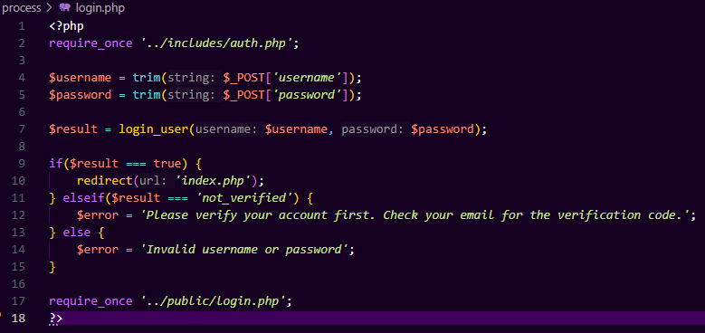
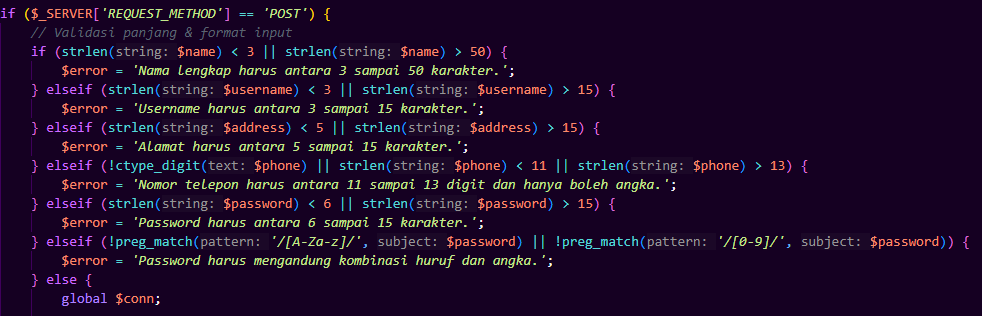

# Code Walkthrough
| No | Fitur / Bagian                | Cuplikan / Deskripsi Kode Utama                                                                          | Hasil Analisis / Penjelasan                                                                                         | Screenshot |
|----|-------------------------------|----------------------------------------------------------------------------------------------------------|----------------------------------------------------------------------------------------------------------------------|------------|
| 1  | Pengambilan Input `Login` User| `$username = trim($_POST['username']);` ` $password = trim($_POST['password']);`                         | Input hanya di-trim, belum ada sanitasi atau validasi isi (kosong/format). Perlu penguatan dari sisi keamanan.       |       |
| 2  | Pemeriksaan Status `Login`    | `if($result === true) { redirect('index.php'); } elseif($result === 'not_verified') { ... } else { ... }`| Sudah mencakup logika bercabang: berhasil, akun belum diverifikasi, dan gagal. Ini baik untuk path testing.          |       |
| 3  | Validasi Data `Register` User | Cek panjang dan format nama, username, alamat, nomor HP, password                                        | Validasi lengkap & ketat. Cek digit untuk HP, panjang input, dan kombinasi huruf-angka untuk password. ✔️ Sangat baik untuk mencegah input tidak valid. |       |
| 4  | Pengecekan Duplikasi Data `Register`| Query `SELECT * FROM customers WHERE username = ? OR email = ?` menggunakan prepared statement     | ✅ Aman dari SQL Injection. Sudah menggunakan parameter binding `(bind_param)`. Mengecek eksistensi username/email dan memberikan pesan sesuai.         |       |
| 5  | Penanganan Error Session `Register` | `$error = $_SESSION['error'] ?? 'Registrasi gagal. ilakan coba lagi.';unset($_SESSION['error']);`  | Menangani error fallback dari fungsi register_user(), menggunakan session. ✔️ Baik, namun pastikan session_start() dilakukan sebelumnya.                |       |
