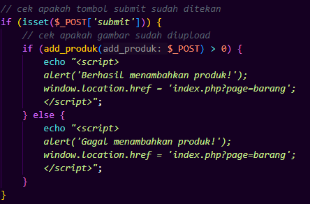

## 1. Insert Barang

---
### a. Deskripsi Fungsional
Fitur ini digunakan untuk menambahkan produk baru melalui form input. Data yang dikirim oleh user akan diproses oleh fungsi `add_produk()` yang bertugas menyimpan ke database setelah memvalidasi bahwa `nama_kategori` yang dipilih valid (tersedia di tabel `kategori`).


### b. Logika Insert & Fungsi
|  |  |
|------------------|---------------------|


### c. Alur Logika Gabungan
```
graph TD
    A(Mulai - User Isi Form) --> B[Klik Submit]
    B --> C[insert/index.php: Cek isset($_POST['submit'])]
    C --> D[add_produk($_POST)]
    D --> E[Ambil id_kategori dari nama_kategori]
    E --> F[Insert data produk ke DB]
    F --> G{Insert berhasil?}
    G -- Ya --> H[Alert sukses + redirect]
    G -- Tidak --> I[Alert gagal + redirect]
```

### c. Test Case (UI + Backend)
| TC | Submit? | Insert DB Berhasil? | Expected Output                      |
| -- | ------- | ------------------- | ------------------------------------ |
| 1  | ❌ Tidak | -                   | Tidak terjadi apa-apa                |
| 2  | ✅ Ya    | ✅ Ya                | Alert "Berhasil menambahkan produk!" |
| 3  | ✅ Ya    | ❌ Tidak             | Alert "Gagal menambahkan produk!"    |

---
## 2. Edit Barang


