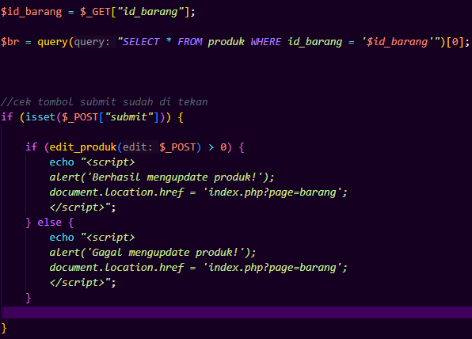
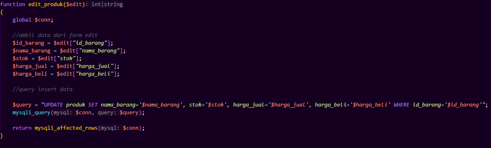
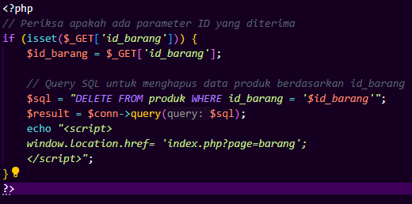

## 1. Insert Barang

---
### a. Deskripsi Fungsional
Fitur ini digunakan untuk menambahkan produk baru melalui form input. Data yang dikirim oleh user akan diproses oleh fungsi `add_produk()` yang bertugas menyimpan ke database setelah memvalidasi bahwa `nama_kategori` yang dipilih valid (tersedia di tabel `kategori`).


### b. Logika Insert & Fungsi
|  |  |
|------------------|---------------------|


### c. Alur Logika Gabungan
```
graph TD
    A(Mulai - User Isi Form) --> B[Klik Submit]
    B --> C[insert/index.php: Cek isset($_POST['submit'])]
    C --> D[add_produk($_POST)]
    D --> E[Ambil id_kategori dari nama_kategori]
    E --> F[Insert data produk ke DB]
    F --> G{Insert berhasil?}
    G -- Ya --> H[Alert sukses + redirect]
    G -- Tidak --> I[Alert gagal + redirect]
```

### d. Test Case 
| TC | Submit? | Insert DB Berhasil? | Expected Output                      |
| -- | ------- | ------------------- | ------------------------------------ |
| 1  | ❌ Tidak | -                   | Tidak terjadi apa-apa                |
| 2  | ✅ Ya    | ✅ Ya                | Alert "Berhasil menambahkan produk!" |
| 3  | ✅ Ya    | ❌ Tidak             | Alert "Gagal menambahkan produk!"    |

---
## 2. Edit Barang
### a. Deskripsi Fungsional
Memungkinkan pengguna untuk mengubah informasi barang yang sudah ada di database, seperti nama barang, stok, harga jual, dan harga beli.

### b. Logika Edit & Fungsi
|  |  |
|------------------|---------------------|

### c. Alur Logika Gabungan
```
graph TD
    A(Mulai - User membuka halaman edit) --> B[Ambil id_barang via $_GET]
    B --> C[Tampilkan data produk di form]
    C --> D{Klik Submit?}
    D -- Tidak --> E[Selesai, tidak ada aksi]
    D -- Ya --> F[edit_produk($_POST)]
    F --> G[UPDATE produk di DB]
    G --> H{UPDATE berhasil?}
    H -- Ya (return > 0) --> I[Alert "Berhasil update"]
    H -- Tidak (return <= 0) --> J[Alert "Gagal update"]
```

### d. Test Case 
| TC | Submit? | Data Berubah? | Expected Output                      |
| -- | ------- | ------------- | ------------------------------------ |
| 1  | ❌ Tidak | -             | Tidak ada aksi, halaman hanya tampil |
| 2  | ✅ Ya    | Ya            | Alert “Berhasil mengupdate produk!”  |
| 3  | ✅ Ya    | Tidak         | Alert “Gagal mengupdate produk!”     |

---
## 3. Delete Barang
### a. Deskripsi Fungsional
Menghapus data produk dari database berdasarkan id_barang yang dikirimkan melalui parameter URL ($_GET['id_barang']).

### b. Logika Delete


### c. Alur Logika
```
graph TD
    A(Mulai - Halaman Dihubungi) --> B{Ada $_GET['id_barang']?}
    B -- Tidak --> C(Selesai - Tidak terjadi apa-apa)
    B -- Ya --> D(Hapus data produk dari DB)
    D --> E(Redirect ke index.php?page=barang)
```

### d. Test Case
| TC | `$_GET['id_barang']` Tersedia? | ID Valid di DB? | Expected Output                                          |
| -- | ------------------------------ | --------------- | -------------------------------------------------------- |
| 1  | ❌ Tidak                        | -               | Tidak terjadi apa-apa                                    |
| 2  | ✅ Ya                           | ✅ Ya            | Produk dihapus, redirect ke halaman barang               |
| 3  | ✅ Ya                           | ❌ Tidak         | Tidak ada yang dihapus, tetap redirect ke halaman barang |
