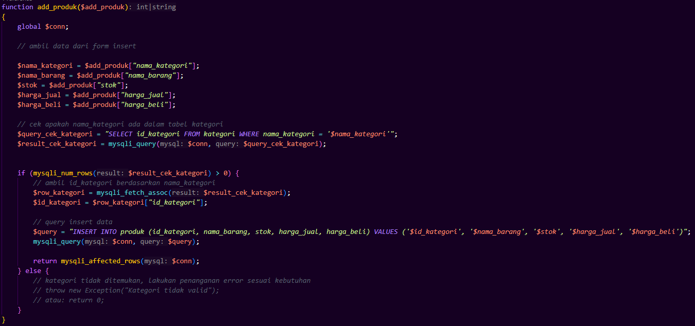

## 1. Insert Barang

---
### a. Deskripsi Fungsional
Form ini menangani proses penambahan barang baru. Ketika form dikirim (submit), data dari $_POST dikirim ke fungsi add_produk() untuk ditambahkan ke database. Terdapat umpan balik berupa alert dan redirect.

### b. Logika Utama
|Insert Produk    | Fungsi add_produk   |
|  |  |
|------------------|---------------------|

### c. Flowchart
graph TD
    A(Mulai) --> B{$_POST['submit'] ada?}
    B -- Ya --> C{add_produk > 0?}
    C -- Ya --> D[Alert 'Berhasil' + Redirect]
    C -- Tidak --> E[Alert 'Gagal' + Redirect]
    B -- Tidak --> F[Stop]
