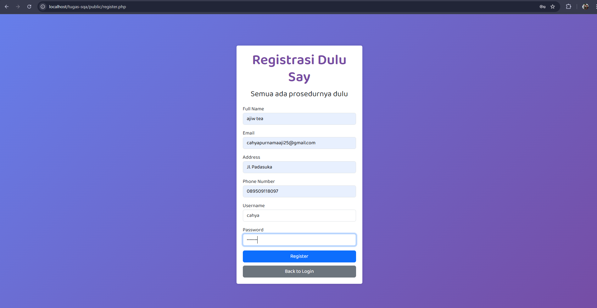

| No | Bagian      | Komponen / File         | Deskripsi Pemeriksaan                                                                                                            | Hasil Pemeriksaan                                                                 | Code Program                                                                                                                                         | Screenshot Tampilan              |
|----|-------------|--------------------------|-----------------------------------------------------------------------------------------------------------------------------------|------------------------------------------------------------------------------------|------------------------------------------------------------------------------------------------------------------------------------------------------|----------------------------------|
| 1  | Process     | `register.php`           | Menerima input form, validasi panjang dan format (nama, username, alamat, telp, password), serta cek duplikasi email/username.   | ✔️ Validasi input berhasil, jika tidak valid ditampilkan pesan error               | [register.php](https://github.com/aryasltnsyh/TESTING-WEB-KELOMPOK-10/blob/WhiteBox-Testing/White%20BOX/Desk%20Checking/Proses/register.php)         |                    |
| 2  | Autentikasi | `register_user()`        | Menyimpan user baru ke database dengan password yang di-*hash*, dan menyimpan kode verifikasi ke session.                        | ✔️ Data user tersimpan, password di-*hash*, dan kode verifikasi disimpan ke session| [auth_regis.php](https://github.com/aryasltnsyh/TESTING-WEB-KELOMPOK-10/blob/WhiteBox-Testing/White%20BOX/Desk%20Checking/Fungsi/auth_regis.php)     |      |
| 3  | Process     | `verify.php`             | Menerima input kode verifikasi dari pengguna, memanggil `verify_user()`, dan mengarahkan ke halaman login jika sukses.           | ✔️ Jika kode benar, akun diverifikasi dan diarahkan ke login; jika salah, muncul pesan error | [verify.php](https://github.com/aryasltnsyh/TESTING-WEB-KELOMPOK-10/blob/WhiteBox-Testing/White%20BOX/Desk%20Checking/Proses/verify.php)            |                   |
| 4  | Autentikasi | `verify_user()`          | Melakukan update status `is_verified = 1` jika email dan kode cocok di database.                                                 | ✔️ Verifikasi berhasil jika data cocok, gagal jika tidak                            | [auth_verify.php](https://github.com/aryasltnsyh/TESTING-WEB-KELOMPOK-10/blob/WhiteBox-Testing/White%20BOX/Desk%20Checking/Fungsi/auth_verify.php)   | –                                |
| 5  | Process     | `login.php`              | Menerima input login (username dan password), memanggil `login_user()`, dan mengarahkan ke index jika berhasil.                 | ✔️ Jika user terverifikasi dan kredensial benar, login berhasil dan redirect ke index | [login.php](https://github.com/aryasltnsyh/TESTING-WEB-KELOMPOK-10/blob/WhiteBox-Testing/White%20BOX/Desk%20Checking/Proses/login.php)              |                    |
| 6  | Autentikasi | `login_user()`           | Mengecek username dan password. Jika cocok dan sudah diverifikasi (`is_verified = 1`), simpan sesi login dan redirect.           | ✔️ Login berhasil jika user valid & terverifikasi; jika tidak, muncul pesan sesuai kondisi | [auth_login.php](https://github.com/aryasltnsyh/TESTING-WEB-KELOMPOK-10/blob/WhiteBox-Testing/White%20BOX/Desk%20Checking/Fungsi/auth_login.php)     | –                                |
