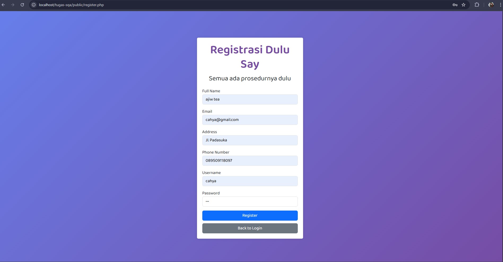
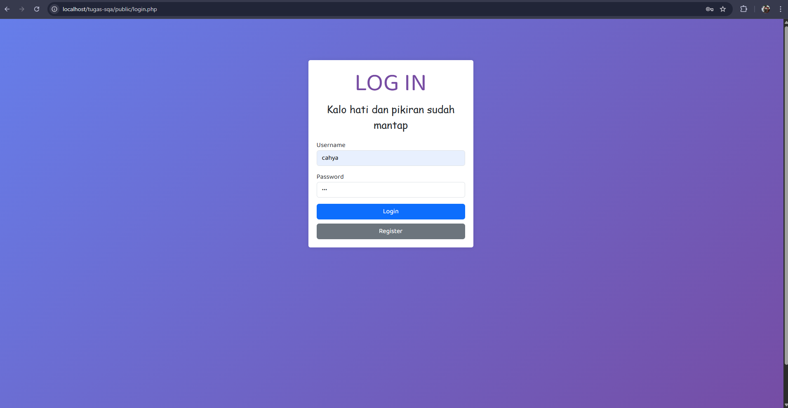
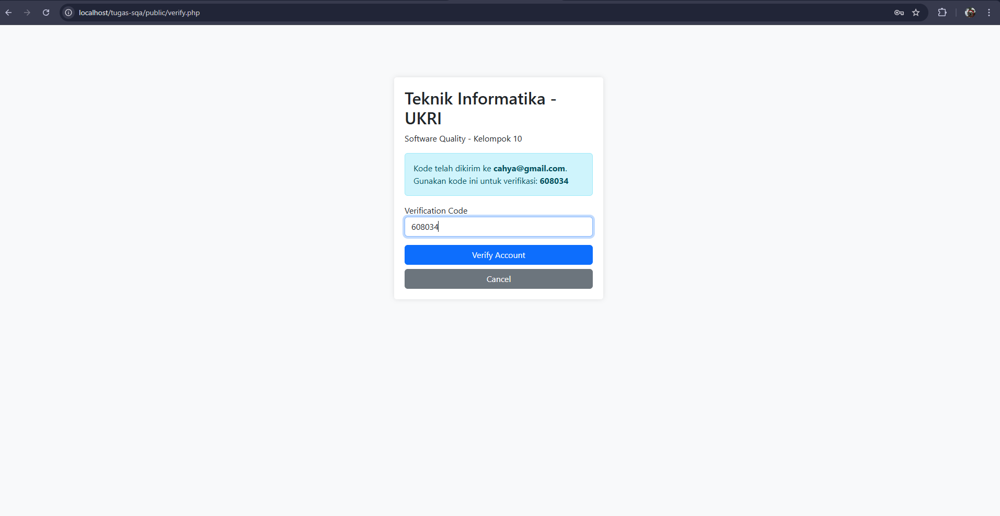
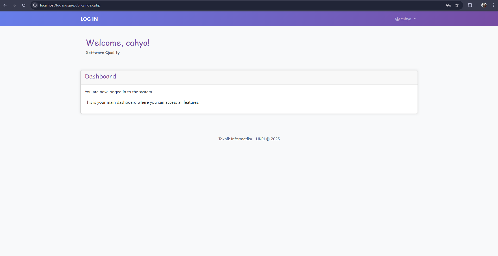

| Bagian      | Komponen                  | Deskripsi Pemeriksaan                                                                 | Hasil Pemeriksaan                                       | Code Program                                                                                                                                         | Screenshot Tampilan              |
|-------------|---------------------------|----------------------------------------------------------------------------------------|----------------------------------------------------------|------------------------------------------------------------------------------------------------------------------------------------------------------|----------------------------------|
| Autentikasi | `register()`              | Input disimpan di DB dengan `generate_password_hash()`                                 | ✔️ Password tersimpan dalam bentuk hash                  | [Register.php](https://github.com/aryasltnsyh/TESTING-WEB-KELOMPOK-10/blob/main/White%20BOX/Desk%20Checking/Register.php)                         |                 |
| Autentikasi | `login()`                 | Password diverifikasi dengan `check_password_hash()`                                   | ✔️ Login berhasil jika password benar                    | [Login.php](https://github.com/aryasltnsyh/TESTING-WEB-KELOMPOK-10/blob/main/White%20BOX/Desk%20Checking/Login.php)                               |                    |
| Autentikasi | `sendVerificationEmail()` | Email verifikasi dikirim ke user dengan link yang berisi kode verifikasi unik          | ✔️ Email verifikasi berhasil dikirim ke alamat user      | [Verify.php](https://github.com/aryasltnsyh/TESTING-WEB-KELOMPOK-10/blob/main/White%20BOX/Desk%20Checking/Verify.php)                             |                   |
| Autentikasi | `dashboard.php`           | Hanya user login dan terverifikasi yang dapat mengakses. Data ditarik berdasarkan sesi | ✔️ Hanya user terautentikasi yang dapat akses dashboard  | [Dashboard.php](https://github.com/aryasltnsyh/TESTING-WEB-KELOMPOK-10/blob/main/White%20BOX/Desk%20Checking/Dashboard.php)                       |               |
