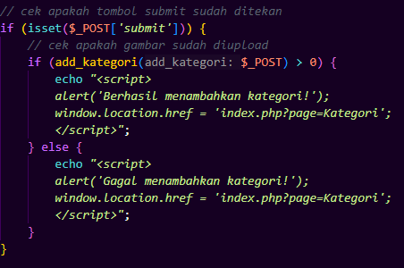
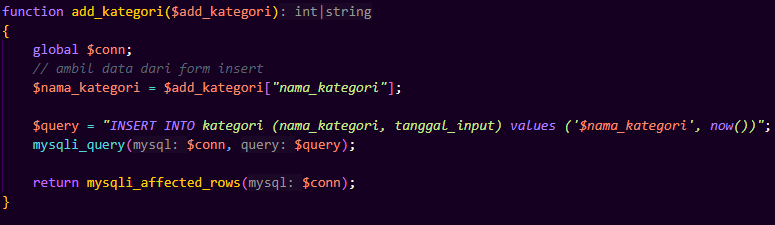
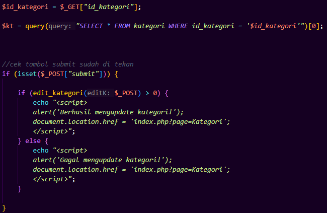
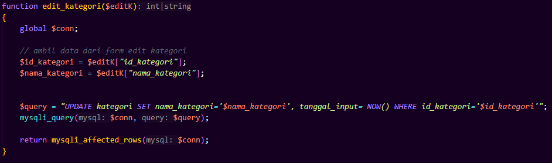
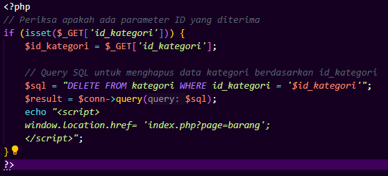

## 1. Insert Kategori

---
### a. Deskripsi Fungsional
Memungkinkan pengguna untuk menambahkan kategori baru ke dalam tabel kategori, dengan mencatat nama kategori dan tanggal input secara otomatis.


### b. Logika Insert & Fungsi
|  |  |
|------------------|---------------------|


### c. Alur Logika Gabungan
```
graph TD
    A(Mulai - Halaman Dibuka) --> B{Klik Submit?}
    B -- Tidak --> C(Form tampil, tidak ada aksi)
    B -- Ya --> D[Panggil add_kategori()]
    D --> E{Query berhasil (apapun datanya)?}
    E -- Ya --> F[Alert "Berhasil menambahkan kategori"]
    E -- Tidak --> G[Alert "Gagal menambahkan kategori"]
    F --> H[Redirect ke halaman kategori]
    G --> H
```

### d. Test Case 
| TC | Submit Diklik? | Input `nama_kategori`     | Kategori Baru?                                                 | Expected Output                                                              |
| -- | -------------- | ------------------------- | -------------------------------------------------------------- | ---------------------------------------------------------------------------- |
| 1  | ❌ Tidak        | -                         | -                                                              | Form tampil, tidak ada aksi                                                  |
| 2  | ✅ Ya           | `"Dewasa"`                | ✅ Ya                                                           | Alert "Berhasil menambahkan kategori", redirect                              |
| 3  | ✅ Ya           | `"Dewasa"` (sama persis)  | ✅ Ya                                                           | Alert "Berhasil menambahkan kategori", redirect                              |
| 4  | ✅ Ya           | `""` (kosong)             | ✅ Ya                                                           | Alert "Berhasil menambahkan kategori", redirect                              |

---

## 2. Edit Kategori

---
### a. Deskripsi Fungsional
Memungkinkan pengguna untuk mengubah nama kategori yang sudah ada, serta memperbarui kolom tanggal_input ke waktu saat ini.


### b. Logika Insert & Fungsi
|  |  |
|------------------|---------------------|


### c. Alur Logika Gabungan
```
graph TD
    A(Mulai - Halaman Dibuka) --> B[Ambil ID Kategori dari GET]
    B --> C[Tampilkan data ke form edit]
    C --> D{Klik Submit?}
    D -- Tidak --> E(Tunggu input user)
    D -- Ya --> F[Panggil edit_kategori()]
    F --> G{Query berhasil (affected_rows > 0)?}
    G -- Ya --> H[Alert "Berhasil mengupdate kategori"]
    G -- Tidak --> I[Alert "Gagal mengupdate kategori"]
    H --> J[Redirect ke halaman kategori]
    I --> J
```

### d. Test Case 
| TC | ID Kategori Valid? | Submit? | Input `nama_kategori`       | Terjadi Update?           | Expected Output                |
| -- | ------------------ | ------- | --------------------------- | ------------------------- | ------------------------------ |
| 1  | ❌ Tidak            | ❌       | -                           | ❌ Tidak                   | Halaman error / redirect gagal |
| 2  | ✅ Ya               | ✅       | `"Dewasa"`                  | ✅ Ya                      | Alert "Berhasil mengupdate kategori, redirect         |
| 3  | ✅ Ya               | ✅       | `"Dewasa"` (tidak berubah)  | ❌ Tidak (0 rows affected) | Alert "Gagal mengupdate kategori, redirect            |
| 4  | ✅ Ya               | ✅       | `""` (kosong)               | ✅ Ya                      | Alert "Berhasil mengupdate kategori, redirect         |
| 5  | ✅ Ya               | ✅       | `"Dewasa"` (duplikat)       | ✅ Ya                      | Alert "Berhasil mengupdate kategori, redirect         |
---

## 3. Delete Kategori

---
### a. Deskripsi Fungsional
Menghapus satu entri kategori dari tabel kategori berdasarkan parameter id_kategori yang dikirim melalui URL (metode GET).


### b. Logika Delete 
   


### c. Alur Logika Gabungan
```
graph TD
    A(Halaman Dipanggil) --> B{GET id_kategori ada?}
    B -- Tidak --> C(Halaman diam, tidak ada aksi)
    B -- Ya --> D[Jalankan DELETE FROM kategori]
    D --> E[Redirect ke halaman barang]

```

### d. Test Case 
| TC | `id_kategori` Dikirim? | ID Valid di DB?             | Output                                        | Catatan                                   |
| -- | ---------------------- | --------------------------- | --------------------------------------------- | ----------------------------------------- |
| 1  | ❌ Tidak                | -                           | Tidak ada aksi                                | Tidak ada redirect, fungsi tidak jalan    |
| 2  | ✅ Ya                   | ✅ Ya (tidak dipakai produk) | Kategori terhapus, redirect ke halaman barang | Normal - kondisi ideal                    |
| 3  | ✅ Ya                   | ✅ Ya (dipakai di produk)    | Error: `Cannot delete or update a parent row` | Foreign key constraint aktif, gagal hapus |
