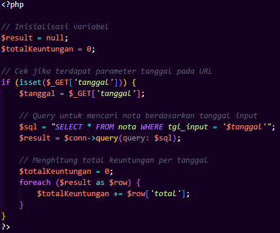
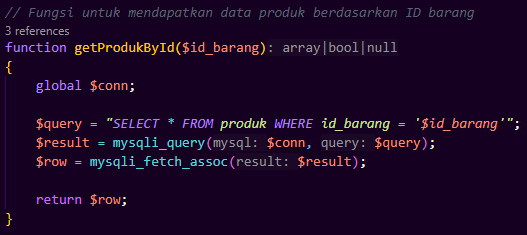

## 1. Laporan / Nota

---
### a. Deskripsi Fungsional
Halaman ini bertujuan untuk menampilkan data nota berdasarkan tanggal (tgl_input) yang dikirimkan melalui parameter $_GET['tanggal'].


### b. Logika Insert & Fungsi
|  |  |
|------------------|---------------------|


### c. Alur Logika Gabungan
```
graph TD
    A(Halaman Dipanggil) --> B{GET parameter 'tanggal' ada?}
    B -- Tidak --> C(Inisialisasi<br>result = null,<br>totalKeuntungan = 0)
    B -- Ya --> D[Ambil nilai tanggal dari GET]
    D --> E[Jalankan SELECT * FROM nota<br>WHERE tgl_input = tanggal]
    E --> F[Simpen hasil ke result]
    F --> G{Ada baris dalam result?}
    G -- Tidak --> H(Tampilkan kosong,<br>totalKeuntungan = 0)
    G -- Ya --> I[Loop setiap baris<br>tambahkan total ke totalKeuntungan]
    I --> J(Tampilkan daftar nota<br>dan total keuntungan)
```

### d. Test Case 
| TC | `tanggal` Dikirim? | Format Valid?                | Data Ada di DB?  | Output                                           | Catatan                                           |
| -- | ------------------ | ---------------------------- | ---------------- | ------------------------------------------------ | ------------------------------------------------- |
| 1  | ❌ Tidak            | -                            | -                | Tidak ada query, `totalKeuntungan = 0`           | Halaman tetap tenang, tidak ada hasil ditampilkan |
| 2  | ✅ Ya               | ✅ Ya                         | ✅ Ada            | Data nota ditampilkan, total keuntungan dihitung | Normal                                            |
| 3  | ✅ Ya               | ✅ Ya                         | ❌ Tidak ada      | Tidak ada hasil, `totalKeuntungan = 0`           | Aman, tapi bisa beri notifikasi kosong            |
| 4  | ✅ Ya               | ❌ Format Salah (e.g. `abcd`) | ❌ Error / kosong | Tidak ada hasil, atau bisa error silent          | Perlu validasi tanggal                            |
| 5  | ✅ Ya               | Kosong/null                  | ❌ Tidak          | Sama seperti tidak dikirim                       | Diperlakukan seperti TC 1                         |

---
